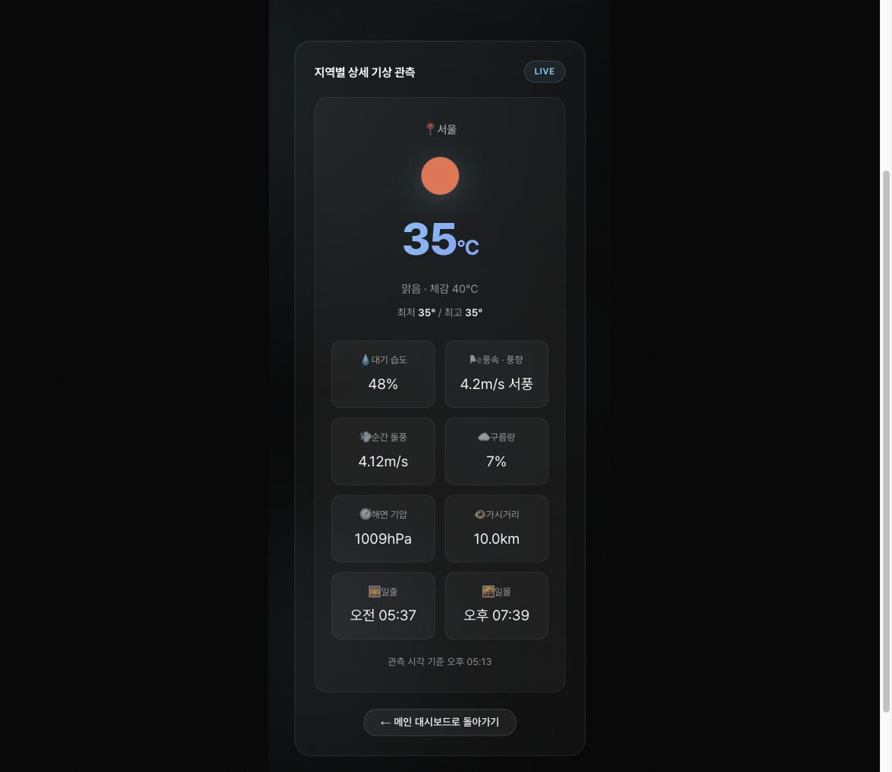

# vue3-playground

Vue 3 + Vite 학습 저장소입니다. 기초 문법부터 Composition API, 컴포넌트 통신, 라우팅까지 단계별로 실습한 코드와,
그 내용을 하나로 모아 만든 **실시간 날씨 대시보드**가 함께 들어 있습니다.

- 🌐 **데모** — https://hyun907.github.io/vue3-playground/
- 🌦️ **데이터** — [OpenWeatherMap](https://openweathermap.org/api) Current Weather / Geocoding API

---

## 화면

### 메인 대시보드 (`/`)

기본 도시 3곳(서울·수원·부산)의 실시간 기온과 상태를 카드로 보여줍니다. 카드마다 현지 시각이 1초 단위로 흐릅니다.


### 도시 검색

목록에 있는 도시는 즉시 필터링되고, 목록에 없는 도시는 디바운스 후 Geocoding API로 전 세계에서 찾아옵니다.
한글 지명("도쿄")도 그대로 검색되며, **추가** 버튼으로 내 목록에 담을 수 있습니다.


### 상세 관측 (`/weather/:cityId`)

체감 기온, 습도, 풍속·풍향, 돌풍, 구름량, 기압, 가시거리, 일출·일몰까지 관측값을 한 화면에 펼칩니다.



---

## 주요 기능

| 기능 | 구현 포인트 |
| --- | --- |
| 실시간 날씨 조회 | `Promise.all`로 여러 도시를 병렬 요청 (`axios`) |
| 도시 검색 | 로컬 필터(`computed`) → 결과 없으면 디바운스 후 원격 Geocoding 검색(`watch`) |
| 한글 지명 지원 | Geocoding 응답의 `local_names.ko`를 우선 사용 |
| 목록 저장 | 도시 코드·한글명만 `localStorage`에 저장, 기온·상태는 매번 새로 수신 |
| 현지 시각 표시 | 부모의 공용 시계(1초 `setInterval`)를 props로 내려 각 카드가 `timezone` 오프셋으로 계산 |
| 상세 페이지 | 라우트 파라미터(`:cityId`)로 조회, 지연 로딩(dynamic import)으로 코드 분할 |
| 상태 처리 | 로딩 / 에러 / 검색 실패 / 빈 목록을 각각 별도 UI로 분기 |

## 기술 스택

- **Vue 3** (`<script setup>` 기반 Composition API)
- **Vite 8** — 개발 서버 및 번들링
- **Vue Router 5** — 히스토리 모드 라우팅, 라우트 단위 코드 분할
- **Pinia 4** — 스토어 (현재는 스캐폴딩 상태)
- **axios** — HTTP 통신
- **ESLint + oxlint + Prettier** — 린트·포매팅
- **GitHub Actions + GitHub Pages** — 배포

## 라우팅

| 경로 | 이름 | 컴포넌트 |
| --- | --- | --- |
| `/` | `WeatherHome` | `views/WeatherHomeView.vue` |
| `/weather/:cityId` | `WeatherDetail` | `views/WeatherDetailView.vue` (지연 로딩) |
| `/:pathMatch(.*)*` | `NotFound` | `/`로 리다이렉트 |

---

## 시작하기

### 1. 의존성 설치

```sh
npm install
```

> Node.js `^22.18.0 || >=24.12.0` 이 필요합니다.

### 2. 환경 변수 설정

프로젝트 루트에 `.env.local` 파일을 만들고 OpenWeatherMap API 키를 넣어 주세요.
키는 [openweathermap.org/api](https://openweathermap.org/api)에서 무료로 발급받을 수 있습니다.

```sh
VITE_OPENWEATHER_API_KEY=발급받은_API_키
```

### 3. 개발 서버 실행

```sh
npm run dev
```

`vite.config.js`의 `base`가 `/vue3-playground/`로 지정되어 있으므로,
개발 서버 접속 주소도 `http://localhost:5173/vue3-playground/` 입니다.

### 그 밖의 스크립트

```sh
npm run build     # 프로덕션 빌드 (dist/)
npm run preview   # 빌드 결과 미리보기
npm run lint      # oxlint + eslint 실행 (--fix)
npm run format    # src/ 프리티어 포매팅
```

---

## 프로젝트 구조

```
src/
├── App.vue                     # 전역 셸 — 히어로 영역, 배경 오브·그레인, RouterView
├── main.js                     # createApp + Pinia + Router 마운트
├── router/index.js             # 라우트 정의
├── views/
│   ├── WeatherHomeView.vue     # 대시보드 페이지
│   └── WeatherDetailView.vue   # 도시 상세 페이지
├── components/
│   ├── exercise/               # 날씨 대시보드 구성 컴포넌트
│   │   ├── WeatherParent.vue       # 데이터 수신·검색·저장 등 상태 소유
│   │   ├── WeatherCard.vue         # 도시 카드 (props/emits, 현지 시각)
│   │   ├── SearchBar.vue           # 검색 입력 (커스텀 이벤트로 상위 전달)
│   │   └── BaseDashboardCard.vue   # 슬롯 기반 공통 카드 프레임
│   └── practices/              # 학습 단계별 예제 모음
│       ├── basic/                  # v-bind·v-if·v-for·v-model·이벤트 등 (23개)
│       ├── composition/            # ref/reactive·computed·watch·watchEffect (10개)
│       └── component/              # 생명주기·props/emits·slot (10개)
├── assets/                     # 전역 CSS
└── stores/                     # Pinia 스토어
```

`src/practices/App.vue.1st`, `App.vue.2nd` 와 `components/exercise/WeatherMockup.vue`,
`WeatherComposition.vue` 는 이전 실습 단계를 남겨 둔 아카이브로, 현재 화면에는 연결되어 있지 않습니다.

---

## 배포

`main` 브랜치에 푸시하면 GitHub Actions가 빌드 후 GitHub Pages로 배포합니다
(`.github/workflows`). API 키는 저장소 시크릿 `VITE_OPENWEATHER_API_KEY`로 주입됩니다.

## 권장 개발 환경

[VS Code](https://code.visualstudio.com/) + [Vue (Official)](https://marketplace.visualstudio.com/items?itemName=Vue.volar) 확장 (Vetur는 비활성화)

브라우저에는 [Vue.js devtools](https://chromewebstore.google.com/detail/vuejs-devtools/nhdogjmejiglipccpnnnanhbledajbpd) 설치를 권장합니다.
